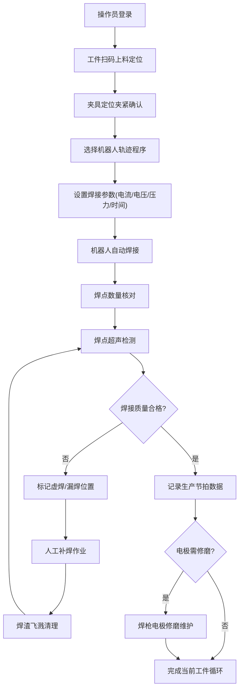

## 1. 产品概述

焊接机器人工作站车身焊装业务Web系统，用于焊装车间管理夹具、焊接和质检全流程，实现工件上料、夹具定位、机器人焊接、焊点检测、补焊修整、节拍监控、设备维护七大模块的数字化管理。

- 主要目的：提升焊装车间生产效率，规范焊接工艺流程，确保焊接质量可追溯
- 目标用户：焊装车间操作员、质检人员、设备维护工程师、生产管理人员
- 产品价值：实现焊装生产全流程可视化、数字化、可追溯化管理

## 2. 核心功能

### 2.1 用户角色

| 角色 | 登录方式 | 核心权限 |
|------|----------|----------|
| 操作员 | 工号登录 | 工件上料、夹具操作、执行焊接、补焊作业 |
| 质检员 | 工号登录 | 焊点检测、质量记录、质检报告查看 |
| 维护工程师 | 工号登录 | 设备维护、电极修磨、故障处理 |
| 生产管理员 | 工号登录 | 节拍监控、生产统计、全模块查看 |

### 2.2 功能模块

1. **工件上料模块**：工件上料定位、工件信息录入、上料状态监控
2. **夹具定位模块**：焊接夹具夹紧、夹具状态显示、定位精度监控
3. **机器人焊接模块**：机器人轨迹程序、焊接电流电压、点焊压力时间、焊接参数配置
4. **焊点检测模块**：焊点数量核对、焊点超声检测、虚焊漏焊检查、质检记录
5. **补焊修整模块**：人工补焊、焊渣飞溅清理、修整记录
6. **节拍监控模块**：生产节拍统计、实时节拍监控、生产效率分析
7. **设备维护模块**：焊枪电极修磨、设备维护计划、维护记录管理

### 2.3 页面详情

| 页面名称 | 模块名称 | 功能描述 |
|----------|----------|----------|
| 总控仪表盘 | 数据概览 | 实时生产状态、七大模块进度、今日产量、合格率统计、设备状态 |
| 工件上料页 | 工件上料 | 工件扫码录入、上料位置定位、上料状态指示、历史上料记录 |
| 夹具定位页 | 夹具定位 | 夹具夹紧/释放控制、定位传感器数据、夹具状态监控、定位精度记录 |
| 机器人焊接页 | 机器人焊接 | 轨迹程序选择、电流电压实时曲线、点焊参数设置、焊接进度显示 |
| 焊点检测页 | 焊点检测 | 焊点数量核对表、超声检测结果、虚焊漏焊标记、检测报告生成 |
| 补焊修整页 | 补焊修整 | 补焊位置标记、人工补焊记录、焊渣清理确认、修整质量复核 |
| 节拍监控页 | 节拍监控 | 实时节拍计时、节拍统计图表、OEE分析、生产效率趋势 |
| 设备维护页 | 设备维护 | 电极修磨记录、维护计划日历、设备健康状态、备件更换提醒 |

## 3. 核心流程

操作员登录系统后，进行工件扫码上料定位，系统确认夹具夹紧后启动机器人焊接程序，焊接完成后执行焊点超声检测，发现虚焊漏焊则进入补焊修整流程，合格后记录生产节拍，系统自动监控设备状态并提醒电极修磨等维护作业。

## 4. 用户界面设计

### 4.1 设计风格

- 主色调：工业深蓝色 (#0F172A) 作为主背景，橙红色 (#F97316) 作为操作警示强调色，青色 (#06B6D4) 作为数据高亮色
- 辅助色：深灰色 (#334155) 面板背景，绿色 (#10B981) 正常状态，红色 (#EF4444) 异常状态，黄色 (#F59E0B) 警告状态
- 按钮风格：扁平化设计，圆角4px，悬停时有微妙阴影和颜色加深效果
- 字体：采用 "JetBrains Mono" 作为数据显示字体，"PingFang SC" 作为中文界面字体
- 布局风格：顶部导航栏 + 左侧模块菜单 + 主内容区，采用卡片式面板布局
- 图标风格：Lucide图标库，线条粗细统一为2px

### 4.2 页面设计概览

| 页面名称 | 模块名称 | UI元素 |
|----------|----------|--------|
| 总控仪表盘 | 数据概览 | 深色工业风背景、实时数据卡片、状态指示灯、进度条环形图、趋势折线图、模块快捷入口 |
| 工件上料页 | 工件上料 | 扫码输入框、工件信息卡片、定位示意图、上料状态进度条、历史记录表 |
| 夹具定位页 | 夹具定位 | 夹具位置示意图、夹紧状态指示灯阵列、传感器实时数值表、控制按钮组 |
| 机器人焊接页 | 机器人焊接 | 轨迹程序下拉选择、电流电压实时曲线图、参数调节滑块、焊接进度环形图 |
| 焊点检测页 | 焊点检测 | 焊点分布网格图、合格/不合格颜色标记、超声检测波形图、检测统计卡片 |
| 补焊修整页 | 补焊修整 | 焊点位置标记图、补焊记录表单、清理确认勾选框、质量复核按钮 |
| 节拍监控页 | 节拍监控 | 实时节拍计时器、柱状统计图、饼图(OEE)、趋势折线图、目标节拍对比线 |
| 设备维护页 | 设备维护 | 维护日历视图、电极修磨记录列表、设备健康评分仪表盘、备件提醒卡片 |

### 4.3 响应式

- 采用桌面优先设计，主要面向车间监控大屏和工程师工作站
- 基础支持平板横屏自适应布局
- 关键操作按钮最小尺寸48px×48px，便于触摸操作
- 数据表格支持水平滚动查看完整内容

### 4.4 3D场景指引（本项目不涉及）
