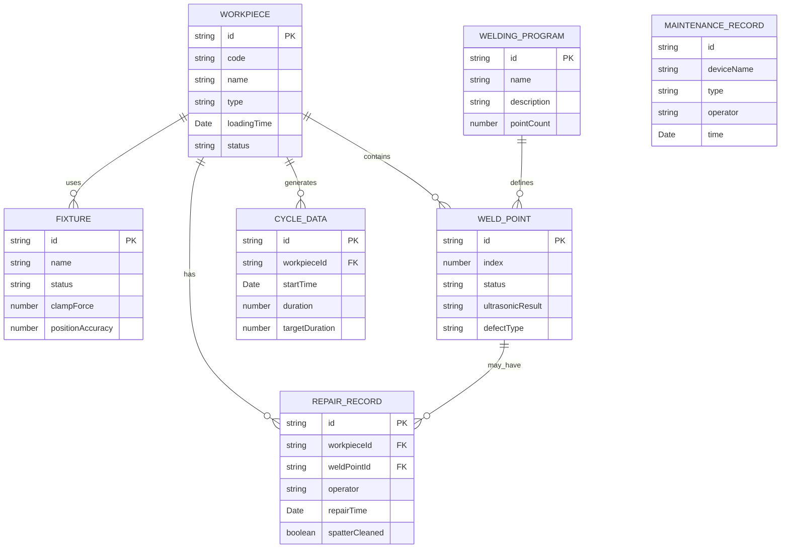

## 1. 架构设计

```mermaid
graph TB
    subgraph "前端展示层 (Frontend)"
        A["React 18 + TypeScript"]
        B["React Router DOM 路由管理"]
        C["Zustand 状态管理"]
        D["TailwindCSS 3 样式系统"]
        E["Recharts 图表库"]
        F["Lucide React 图标库"]
    end

    subgraph "数据层 (Data)"
        G["Mock 模拟数据"]
        H["本地存储 LocalStorage"]
        I["TypeScript 类型定义"]
    end

    subgraph "业务组件层 (Components)"
        J["仪表盘组件"]
        K["工件上料组件"]
        L["夹具定位组件"]
        M["机器人焊接组件"]
        N["焊点检测组件"]
        O["补焊修整组件"]
        P["节拍监控组件"]
        Q["设备维护组件"]
    end

    A --> B
    A --> C
    A --> D
    A --> E
    A --> F
    J --> G
    K --> G
    L --> G
    M --> G
    N --> G
    O --> G
    P --> G
    Q --> G
    J --> H
    K --> H
    L --> H
    M --> H
    N --> H
    O --> H
    P --> H
    Q --> H
    A --> I
    J --> I
    K --> I
    L --> I
    M --> I
    N --> I
    O --> I
    P --> I
    Q --> I
```



## 2. 技术说明

- 前端：React@18 + TypeScript + Vite
- 初始化工具：vite-init
- 后端：无（纯前端项目，使用Mock数据模拟）
- 数据存储：LocalStorage + 前端Mock数据
- UI框架：TailwindCSS@3
- 图表库：Recharts
- 状态管理：Zustand
- 路由管理：React Router DOM
- 图标库：Lucide React

## 3. 路由定义

| 路由 | 用途 |
|------|------|
| / | 总控仪表盘（首页） |
| /loading | 工件上料定位 |
| /fixture | 夹具定位夹紧 |
| /welding | 机器人焊接控制 |
| /inspection | 焊点质量检测 |
| /repair | 补焊修整作业 |
| /cycle | 生产节拍监控 |
| /maintenance | 设备维护管理 |

## 4. API定义（无后端，使用Mock数据）

### TypeScript类型定义

```typescript
// 工件信息
interface Workpiece {
  id: string;
  code: string;
  name: string;
  type: string;
  loadingTime: Date;
  status: 'pending' | 'loading' | 'loaded' | 'completed';
  position: { x: number; y: number; z: number };
}

// 夹具状态
interface Fixture {
  id: string;
  name: string;
  status: 'released' | 'clamping' | 'clamped' | 'error';
  clampForce: number;
  positionAccuracy: number;
  sensors: SensorData[];
}

// 传感器数据
interface SensorData {
  id: string;
  name: string;
  value: number;
  unit: string;
  status: 'normal' | 'warning' | 'error';
}

// 焊接参数
interface WeldingParams {
  current: number;
  voltage: number;
  pressure: number;
  time: number;
  programId: string;
  programName: string;
}

// 焊接程序
interface WeldingProgram {
  id: string;
  name: string;
  description: string;
  defaultParams: WeldingParams;
  pointCount: number;
}

// 焊点信息
interface WeldPoint {
  id: string;
  index: number;
  position: { x: number; y: number };
  status: 'pending' | 'welding' | 'completed' | 'defective' | 'repaired';
  ultrasonicResult?: 'pass' | 'fail' | 'pending';
  defectType?: 'none' | 'cold' | 'missing' | 'spatter';
}

// 补焊记录
interface RepairRecord {
  id: string;
  workpieceId: string;
  weldPointId: string;
  operator: string;
  repairTime: Date;
  description: string;
  spatterCleaned: boolean;
}

// 节拍数据
interface CycleData {
  id: string;
  workpieceId: string;
  startTime: Date;
  endTime?: Date;
  duration?: number;
  targetDuration: number;
  loadingTime: number;
  fixtureTime: number;
  weldingTime: number;
  inspectionTime: number;
  repairTime: number;
}

// 设备维护记录
interface MaintenanceRecord {
  id: string;
  deviceName: string;
  type: 'electrode_dressing' | 'preventive' | 'corrective';
  operator: string;
  time: Date;
  description: string;
  nextMaintenanceDate: Date;
  equipmentHealth: number;
}
```

## 5. 服务器架构图（无后端）

本项目为纯前端实现，不包含后端服务器。数据通过本地Mock数据和LocalStorage模拟。

## 6. 数据模型

### 6.1 数据模型定义



### 6.2 数据定义语言

本项目使用前端Mock数据，无数据库。初始数据通过TypeScript常量定义，在应用启动时加载到Zustand状态管理中，并可通过LocalStorage持久化。
